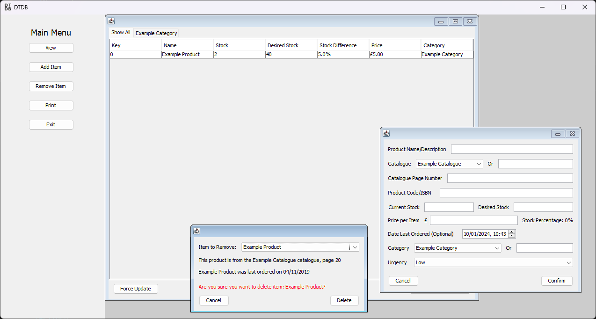

# dtDb

An unfinished Java database application made for a client for A-level WJEC Eduqas Computer Science Component 3. 

- Never finished as a result of COVID-19
- Database stored in a CSV file
- "Print" feature to automatically insert low-stock items into an RTF document order form
- Created in 2019/20 using Apache NetBeans 11.1

## Screenshots

|  |
|:--:|
| *The login screen.* |

|  |
|:--:|
| *The application with the main menu visible on the left and the "view" window open in the workspace on the right.* |

|  |
|:--:|
| *The add and remove item windows open in the workspace.* |

|  |
|:--:|
| *The "print" window that allows users to export a populated order form ready for printing.* |
